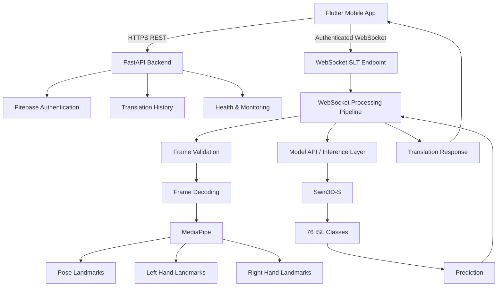
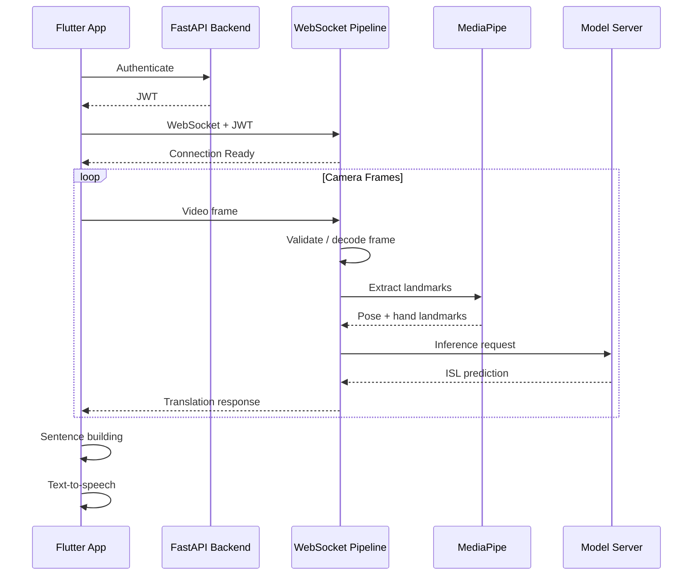

# signBridge

A real-time **Indian Sign Language (ISL) recognition and translation system** built around a Flutter client, FastAPI backend, WebSocket-based streaming, MediaPipe landmark processing, and a fine-tuned Swin3D-S recognition model.


---

## Overview

**signBridge** is a real-time Indian Sign Language system that combines video-based sign recognition with a mobile translation interface.

The system consists of:

* A **Flutter mobile application** for camera capture, live translation, sentence construction, and text-to-speech.
* A **FastAPI backend** providing authentication, history, health monitoring, REST APIs, and WebSocket communication.
* A **real-time WebSocket processing pipeline** for receiving camera frames and coordinating sign-language processing.
* **MediaPipe Pose and Hand Landmarker** models for extracting body and hand landmarks.
* A fine-tuned **Swin3D-S** video recognition model capable of classifying 76 ISL word classes.
* **Firebase** for authentication and user synchronization.
* A separate model-serving layer for computationally expensive inference.

The backend is designed so that the mobile client does not need to directly communicate with the model infrastructure.

---

# Architecture

## System Architecture



## Request Flow

```text
                         ┌──────────────────────┐
                         │    Flutter Client    │
                         │                      │
                         │ Camera / UI / TTS    │
                         └──────────┬───────────┘
                                    │
                         HTTPS / WebSocket
                                    │
                                    ▼
                    ┌────────────────────────────┐
                    │      FastAPI Backend       │
                    │                            │
                    │ Auth / REST / WebSocket    │
                    └─────────────┬──────────────┘
                                  │
                    ┌─────────────┴─────────────┐
                    │                           │
                    ▼                           ▼
          ┌──────────────────┐       ┌──────────────────┐
          │ Firebase Auth    │       │ Translation DB   │
          └──────────────────┘       └──────────────────┘

                                  │
                                  ▼
                    ┌────────────────────────────┐
                    │ WebSocket Processing       │
                    │ Pipeline                   │
                    └─────────────┬──────────────┘
                                  │
                     Frame Processing
                                  │
                                  ▼
                    ┌────────────────────────────┐
                    │ MediaPipe Landmarkers      │
                    │                            │
                    │ Pose + Left Hand + Right   │
                    └─────────────┬──────────────┘
                                  │
                                  ▼
                    ┌────────────────────────────┐
                    │ Model / Inference Layer    │
                    │                            │
                    │ Swin3D-S / Model API      │
                    └─────────────┬──────────────┘
                                  │
                                  ▼
                    ┌────────────────────────────┐
                    │ ISL Prediction             │
                    │                            │
                    │ 76 Word Classes            │
                    └─────────────┬──────────────┘
                                  │
                                  ▼
                         WebSocket Response
                                  │
                                  ▼
                    ┌────────────────────────────┐
                    │ Flutter Sentence Builder   │
                    │ + TTS + Translation UI     │
                    └────────────────────────────┘
```

---

# Demo

https://github.com/user-attachments/assets/130351a1-b1d9-4432-a4a4-7e64ee8ec296

---

# Model Results

The current recognition model was evaluated on 76 ISL word classes.

| Metric          |      Value |
| --------------- | ---------: |
| Top-1 Accuracy  | **66.84%** |
| Macro F1        |  **0.638** |
| Weighted F1     |  **0.648** |
| ISL Classes     |     **76** |
| Test Samples    |    **187** |
| Random Baseline |   **1.3%** |

These results correspond to the Swin3D-S recognition model described below.

---

# Recognition Model

## Swin3D-S

The recognition model uses the **Swin3D-S (Video Swin Transformer Small)** architecture.

The backbone is pretrained on **Kinetics-400** and fine-tuned for 76 Indian Sign Language word classes.

```text
Input Video
3 × 16 × 224 × 224
        │
        ▼
Patch Embedding
Conv3D
96 channels
        │
        ▼
Swin Transformer
        │
        ├── Stage 1
        │   2 blocks
        │   dim = 96
        │
        ├── Stage 2
        │   2 blocks
        │   dim = 192
        │
        ├── Stage 3
        │   18 blocks
        │   dim = 384
        │
        └── Stage 4
            2 blocks
            dim = 768
        │
        ▼
Adaptive Average Pooling
        │
        ▼
768-dimensional Feature
        │
        ▼
Linear Classification Head
768 → 76
        │
        ▼
ISL Word Prediction
```

### Model Statistics

| Property             | Value                     |
| -------------------- | ------------------------- |
| Backbone             | Swin3D-S                  |
| Pretraining          | Kinetics-400              |
| Total Parameters     | 33,112,492                |
| Trainable Parameters | 9,510,988                 |
| Model Size           | ~126 MB                   |
| Number of Classes    | 76                        |
| Input                | 16 × 224 × 224 video clip |

### Fine-tuning Strategy

The model uses transfer learning:

* **Frozen**

  * Patch embedding
  * Stage 1
  * Stage 2

* **Fine-tuned**

  * Stage 3
  * Stage 4
  * Normalization layer
  * Classification head

Training configuration:

```text
Loss:
CrossEntropyLoss

Optimizer:
AdamW

Learning Rate:
1e-4

Scheduler:
ReduceLROnPlateau

Scheduler Factor:
0.5

Scheduler Patience:
5

Mixed Precision:
FP16

Early Stopping:
Patience = 5
```

---

# Dataset

The recognition model was trained using the Kaggle dataset:

**Indian Sign Language Words with Landmarks**

Dataset:

```text
https://www.kaggle.com/datasets/kaushikyh/indian-sign-language-words-with-landmarks
```

## Dataset Split

| Split      |   Samples |
| ---------- | --------: |
| Train      |       745 |
| Validation |       234 |
| Test       |       187 |
| **Total**  | **1,166** |

## ISL Classes

The model recognizes 76 ISL word classes:

```text
afternoon
animal
bad
beautiful
big
bird
blind
cat
cheap
clothing
cold
cow
curved
deaf
dog
dress
dry
evening
expensive
famous
fast
female
fish
flat
friday
good
happy
hat
healthy
horse
hot
hour
light
long
loose
loud
minute
monday
month
morning
mouse
narrow
new
night
old
pant
pocket
quiet
sad
saturday
second
shirt
shoes
short
sick
skirt
slow
small
suit
sunday
t_shirt
tall
thursday
time
today
tomorrow
tuesday
ugly
warm
wednesday
week
wet
wide
year
yesterday
young
```

---

# Video Processing

Input videos are `.MOV` files with variable duration.

The recognition pipeline converts them into fixed-size clips:

```text
Variable-length video
        │
        ▼
Frame sampling
        │
        ▼
16 frames
        │
        ▼
224 × 224 resize
        │
        ▼
Normalization
        │
        ▼
Swin3D-S
```

### Preprocessing

* 16-frame temporal clip
* 224 × 224 spatial resolution
* Center crop
* Pixel rescaling
* Mean/std normalization

### Training Augmentation

Training samples use:

* RandomPerspective
* ColorJitter

---

# Real-Time Translation Pipeline

The current application uses a WebSocket-based real-time communication layer rather than requiring every camera interaction to be handled as an independent HTTP request.



## Client

The Flutter application is responsible for:

* Camera capture
* WebSocket communication
* Authentication
* Translation UI
* Prediction display
* Sentence construction
* Translation history
* Text-to-speech

## Backend

The FastAPI backend is responsible for:

* Authentication endpoints
* Authorization
* REST APIs
* WebSocket connections
* Frame validation
* Frame decoding
* Landmark processing
* Model communication
* Translation history
* Health checks
* Error handling
* Rate limiting

## Model Layer

The model layer performs the computationally expensive sign recognition operation.

The current recognition model is based on Swin3D-S and predicts one of the 76 trained ISL classes.

---

# WebSocket Communication

The backend exposes a WebSocket endpoint for real-time sign-language processing.

The connection is authenticated using a Bearer token rather than placing credentials in the WebSocket URL.

```text
Authorization: Bearer <JWT>
```

The WebSocket layer supports binary and encoded frame transport mechanisms.

### Binary JPEG Transport

The project uses an ISLF binary container for batching JPEG frames:

```text
┌───────────────┬──────────────────┬───────────────┐
│ Magic "ISLF"  │ Frame Count      │ Frame Lengths │
│ 4 bytes       │ 2 bytes          │ 4 × N bytes   │
└───────────────┴──────────────────┴───────────────┘
                         │
                         ▼
                  JPEG Frame Data
```

This keeps the framing overhead small while allowing multiple compressed JPEG frames to be transported through a single WebSocket message.

---

# Authentication

Authentication is handled through **Firebase**.

The backend provides authentication functionality including:

* User registration
* Login
* Logout
* Password reset
* Password update
* Authenticated endpoints
* Token validation
* Token revocation handling

The WebSocket layer also requires authentication before processing frames.

Credentials and Firebase configuration are not committed to the repository.

---

# Translation History

Authenticated users can store and retrieve translation history through the backend.

The history layer supports operations such as:

```text
Create translation
        │
        ▼
Store history
        │
        ├── Get history
        ├── Delete translation
        └── Clear history
```

History operations are protected by authentication and backend authorization.

---

# API

The FastAPI backend provides REST and WebSocket interfaces.

## Health

```http
GET /
```

Basic service endpoint.

```http
GET /health
```

Basic backend health check.

```http
GET /health/deep
```

Deep health check for backend dependencies and model infrastructure.

## Authentication

The backend provides authentication routes for:

```text
Register
Login
Logout
Forgot password
Update password
```

## Translation

Real-time translation is handled through the WebSocket layer.

```text
WebSocket
/ws/slt
```

The WebSocket route is responsible for authenticated real-time sign-language processing.

> The exact endpoint paths should be treated as the source of truth from the current FastAPI application and API documentation.

---

# Backend Architecture

The backend is organized into separate application layers.

```text
backend/
│
├── app/
│   ├── config/
│   │   └── Firebase configuration
│   │
│   ├── models/
│   │   └── Backend data models
│   │
│   ├── services/
│   │   ├── authentication
│   │   ├── history
│   │   └── model services
│   │
│   ├── websocket/
│   │   ├── WebSocket handling
│   │   └── frame processing
│   │
│   └── main.py
│
├── deployment/
│   └── Deployment configuration
│
├── models/
│   └── MediaPipe model assets
│
├── tests/
│   ├── regression/
│   ├── live/
│   └── e2e/
│
├── postman/
│   └── API collections
│
├── docs/
│   └── Backend documentation
│
├── pyproject.toml
└── uv.lock
```

---

# Repository Structure

```text
signBridge/
│
├── .github/
│   └── workflows/
│       ├── backend-tests.yml
│       └── frontend-tests.yml
│
├── backend/
│   ├── app/
│   │   ├── config/
│   │   ├── models/
│   │   ├── services/
│   │   ├── websocket/
│   │   └── main.py
│   │
│   ├── deployment/
│   ├── docs/
│   ├── models/
│   ├── postman/
│   ├── temp/
│   ├── tests/
│   │   ├── e2e/
│   │   ├── live/
│   │   └── regression/
│   ├── pyproject.toml
│   └── uv.lock
│
├── frontend/
│   └── Flutter application
│
├── docs/
│
└── README.md
```

---

# Technology Stack

| Layer                 | Technology                |
| --------------------- | ------------------------- |
| Mobile Frontend       | Flutter / Dart            |
| Backend               | FastAPI                   |
| ASGI Server           | Uvicorn                   |
| Real-Time Transport   | WebSocket                 |
| Authentication        | Firebase                  |
| Computer Vision       | MediaPipe                 |
| Recognition Model     | Swin3D-S                  |
| Deep Learning         | PyTorch                   |
| Model Pretraining     | Kinetics-400              |
| Model Hosting         | Hugging Face              |
| Database / History    | Backend persistence layer |
| API Testing           | Python unittest           |
| Dependency Management | uv                        |
| CI                    | GitHub Actions            |
| Deployment            | Render / Hugging Face     |
| Text-to-Speech        | flutter_tts               |

---

# Model Hosting

The trained Swin3D-S model is hosted at:

```text
https://huggingface.co/Creator-090/isl-swin3d-model
```

The model-serving infrastructure can be separated from the main application backend so that:

```text
Flutter
   │
   ▼
FastAPI Backend
   │
   ▼
Model API
   │
   ▼
Swin3D-S
```

The separation allows the application layer and inference layer to be deployed independently.

---

# Training

## Training Platform

The recognition model was trained using:

```text
Platform:
Kaggle Notebooks

GPU:
NVIDIA Tesla T4 15 GB

Framework:
PyTorch 2.10.0 + CUDA 12.8

Pretrained Weights:
Swin3D_S_Weights.KINETICS400_V1
```

## Training Configuration

```python
BATCH_SIZE = 32
CLIP_LENGTH = 16
CLIP_SIZE = 224
EPOCHS = 1000
LR = 0.0001
PATIENCE = 5
SEED = 42
```

Early stopping limits the effective training duration.

The reported training run took approximately:

```text
~3.5 minutes / epoch
~15 effective epochs
~1 hour total
```

---

# Local Development

## Prerequisites

Install:

* Python 3.12
* uv
* Flutter SDK
* Android Studio or Xcode
* Firebase configuration
* Required MediaPipe model assets

---

## Backend

Clone the repository:

```bash
git clone https://github.com/Uni-Creator/signBridge.git
cd signBridge
```

Enter the backend:

```bash
cd backend
```

Install dependencies:

```bash
uv sync
```

Run the FastAPI backend:

```bash
uv run uvicorn app.main:app \
    --host 127.0.0.1 \
    --port 5000
```

The backend will be available at:

```text
http://127.0.0.1:5000
```

For network access from another device:

```bash
uv run uvicorn app.main:app \
    --host 0.0.0.0 \
    --port 5000
```

---

# Firebase Configuration

Firebase credentials are required for authentication.

The Firebase configuration file is intentionally excluded from version control.

For local development, place the required configuration in the backend according to the backend setup documentation.

Do **not** commit Firebase service-account credentials.

For CI/CD, the Firebase configuration is supplied through GitHub Actions secrets.

---

# Flutter Application

Install Flutter dependencies:

```bash
cd frontend
flutter pub get
```

Run the application:

```bash
flutter run
```

The application communicates with the FastAPI backend for authentication, history, and real-time translation.

Configure the backend URL in the appropriate Flutter service/configuration file.

Example:

```dart
static const String API_URL = "https://your-backend.example.com";
```

For local development:

```dart
static const String API_URL = "http://YOUR_LOCAL_IP:5000";
```

The mobile device and development machine must be reachable over the same network when using a local backend.

---

# Testing

The backend contains separate test suites for different levels of validation.

```text
tests/
│
├── regression/
│   └── Fast deterministic backend tests
│
├── live/
│   └── Tests against a running backend
│
└── e2e/
    └── End-to-end application flows
```

## Regression Tests

Run:

```bash
cd backend

uv run python -m unittest discover \
    -s tests/regression \
    -v
```

These tests validate backend behavior without requiring a running production server.

The current regression suite contains **157 tests**.

---

# Live Tests

Live tests run against an actual running backend.

Start the server:

```bash
cd backend

uv run uvicorn app.main:app \
    --host 127.0.0.1 \
    --port 5000
```

In another terminal:

```bash
cd backend

export SIGNBRIDGE_RUN_LIVE_TESTS=1

uv run python -m unittest discover \
    -s tests/live \
    -v
```

The live test configuration supports:

```text
SIGNBRIDGE_RUN_LIVE_TESTS
SIGNBRIDGE_LIVE_EMAIL
SIGNBRIDGE_LIVE_PASSWORD
SIGNBRIDGE_LIVE_BASE_URL
SIGNBRIDGE_LIVE_WS_URL
SIGNBRIDGE_LIVE_FRAMES_DIR
SIGNBRIDGE_LIVE_TIMEOUT
```

Live tests are intentionally separated from regression tests because they require external services and a running backend.

---

# Continuous Integration

GitHub Actions runs the backend test pipeline.

The CI flow is:

```text
Checkout
   │
   ▼
Python Setup
   │
   ▼
Install uv
   │
   ▼
uv sync --frozen
   │
   ▼
Regression Tests
   │
   ▼
Create Firebase Configuration
   │
   ▼
Start FastAPI
   │
   ▼
Health Check
   │
   ▼
Live Tests
   │
   ▼
Backend Logs
   │
   ▼
Shutdown
```

This ensures that live tests execute against an actual FastAPI process rather than an unavailable localhost port.

---

# Deployment

The backend can be deployed as a standalone FastAPI service.

Production architecture:

```text
                         Internet
                            │
                            ▼
                   ┌─────────────────┐
                   │ Flutter Client  │
                   └────────┬────────┘
                            │ HTTPS
                            │ WSS
                            ▼
                   ┌─────────────────┐
                   │ FastAPI Backend │
                   │                 │
                   │ REST + WebSocket│
                   └────────┬────────┘
                            │
                 ┌──────────┴──────────┐
                 │                     │
                 ▼                     ▼
          ┌─────────────┐      ┌────────────────┐
          │ Firebase    │      │ Model Service  │
          │             │      │                │
          │ Auth        │      │ Swin3D-S       │
          └─────────────┘      └────────────────┘
```

For a public deployment, HTTPS/WSS should be used rather than unencrypted HTTP/WebSocket connections.

---

# Health Monitoring

The backend exposes health endpoints for operational monitoring.

## Basic Health

```http
GET /health
```

Used by deployment platforms and CI to verify that the application is accepting requests.

## Deep Health

```http
GET /health/deep
```

The deep health endpoint checks backend dependencies and model-service availability.

This is useful for distinguishing:

```text
Backend is running
```

from:

```text
Backend is running but a dependency/model service is unavailable
```

---

# Security

The system uses several security mechanisms:

* Firebase-based authentication
* Bearer-token authorization
* Authenticated WebSocket connections
* Rate limiting on sensitive endpoints
* Server-side validation
* Payload size validation
* WebSocket transport validation
* Separation of secrets from source control
* HTTPS/WSS in production

Authentication tokens should be transmitted through authorization headers rather than query-string parameters.

---

# Performance

The original model evaluation was performed on an NVIDIA Tesla T4.

Model inference on CPU-based hosting can be significantly slower than GPU inference.

For the earlier HTTP-based deployment configuration, CPU inference on a free Hugging Face Space was approximately:

```text
~4–6 seconds per video clip
```

Actual end-to-end latency depends on:

* Device camera
* Network latency
* Frame transport
* Backend processing
* MediaPipe processing
* Model inference hardware
* Model-server availability
* Queueing and concurrency

---

# Project Goals

The project is designed around three primary goals:

### 1. Real-Time Recognition

Process sign-language input continuously rather than requiring users to manually upload individual videos.

### 2. Accessible Mobile Translation

Provide an accessible Flutter interface for users to communicate through ISL recognition.

### 3. Scalable Architecture

Separate:

```text
Client
   ↓
Application Backend
   ↓
Real-Time Processing
   ↓
Model Infrastructure
```

so that individual components can be developed, tested, deployed, and scaled independently.

---

# Future Work

Potential areas for continued development include:

* Expanding the ISL vocabulary
* Improving recognition accuracy
* Continuous sentence-level translation
* Better temporal modeling
* Improved WebSocket streaming efficiency
* GPU-backed model inference
* More efficient landmark processing
* Multilingual output
* Improved sentence construction
* Larger and more diverse datasets
* Signer-independent evaluation
* Production observability
* Distributed inference
* Model versioning and A/B evaluation

---

# Contributing

Contributions are welcome.

1. Fork the repository.
2. Create a feature branch.

```bash
git checkout -b feature/your-feature
```

3. Make your changes.
4. Run the relevant test suites.

```bash
cd backend
uv run python -m unittest discover -s tests/regression -v
```

5. Commit your changes.

```bash
git commit -m "feat: describe your change"
```

6. Push the branch.

```bash
git push origin feature/your-feature
```

7. Open a Pull Request.

---

# License

This project is licensed under the **MIT License**.

See [`LICENSE`](LICENSE) for details.

---

# Contributors

<a href="https://github.com/Uni-Creator/signBridge/graphs/contributors">
  
</a>

---

# Contact

For questions or inquiries:

**Abhay Singh**

Email: `abhayr24564@gmail.com`

---

## Repository

**GitHub:**
https://github.com/Uni-Creator/signBridge

**Model:**
https://huggingface.co/Creator-090/isl-swin3d-model
